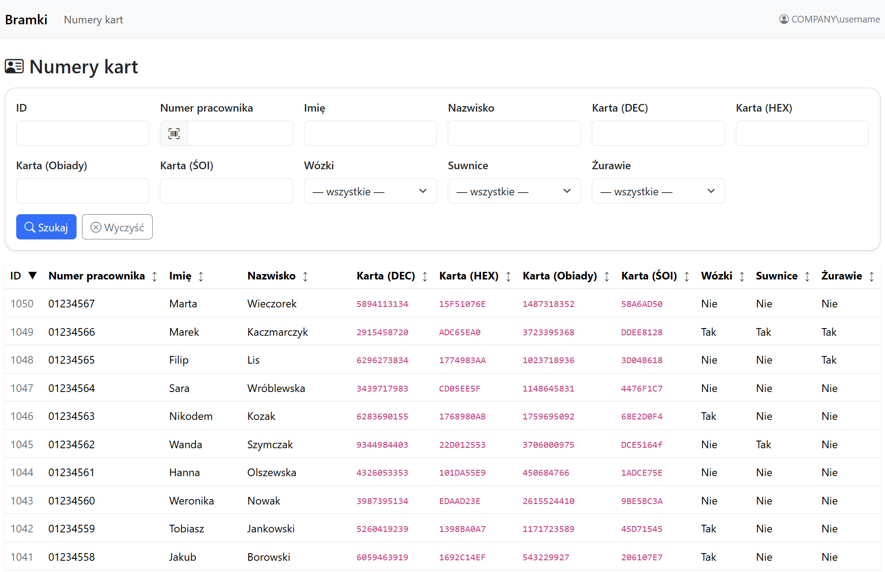

# Employee's Access Cards & Privilege Viewer

A web application built with **ASP.NET Core Razor Pages** and **Entity Framework Core** for searching employees and viewing access card numbers and gate permissions.

The application integrates with an existing SQL Server database and provides filtering, sorting, and quick lookup functionality in a clean web interface.

---

## Features

* Search employees by:

  * Employee number
  * First name
  * Surname
  * Card numbers
* Filter by equipment permissions:

  * Forklifts
  * Cranes
  * Gantries
* Sorting on all columns
* Automatic card number conversions:

  * Lunch card number (DEC)
  * PPE cabinet card number (HEX)
* Windows Authentication (Negotiate)
* Role/group-based authorization
* Responsive Bootstrap UI

---

## Technology Stack

* ASP.NET Core (Razor Pages)
* Entity Framework Core
* SQL Server
* Windows Authentication (Negotiate)
* Bootstrap

---

## Project Structure

```
Bramki/
 ├── Data/
 │    └── AppDbContext.cs
 ├── Models/
 │    ├── Person.cs
 │    └── GatePrivilege.cs
 ├── Pages/
 │    └── People/
 │         ├── Index.cshtml
 │         └── Index.cshtml.cs
 └── Program.cs
```

---

## How It Works

1. The application connects to a SQL Server database.
2. Employees and permissions are loaded using Entity Framework.
3. Filters and sorting are applied in memory.
4. The Razor Pages frontend renders results in a searchable table.

---

## Configuration

Application settings are stored in:

```
appsettings.json
appsettings.Development.json
```

### Database Connection

Set the connection string:

```json
"ConnectionStrings": {
  "Default": "Server=SERVER_NAME;Database=DB_NAME;User ID=LOGIN;Password=PASSWORD;"
}
```

---

## Authentication

The application uses **Windows Authentication**.

Configuration options:

```json
"Auth": {
  "Bypass": true,
  "AllowedGroupSid": "GROUP_SID"
}
```

### Development Mode

In development this is enabled by default:

```
Auth:Bypass = true
```

It disables group validation allowing testing.

---

## Requirements

* .NET 8 SDK
* SQL Server access
* Windows environment (for Negotiate authentication)

---

## Running the Project

1. Clone the repository:

```
git clone https://github.com/vkub4plv/bramki-cards.git
```

2. Configure the connection string.

3. Run:

```
dotnet run
```

4. Open in browser:

```
http://localhost:5000
```

---

## Data Model Overview

### Person

Stores:

* Employee name
* Card numbers
* Employee ID
* Active status

Derived values:

* First name / surname
* Converted card numbers

### GatePrivilege

Stores:

* Equipment permissions
* Relationship to employee

---

## Future Improvements

Possible enhancements:

* Server-side filtering for large datasets
* Pagination
* Export to CSV / Excel
* Audit logging
* UI improvements

---

## Screenshots


